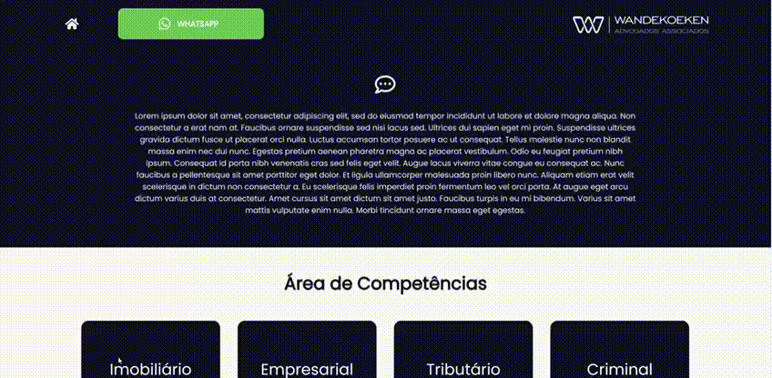

<h1 align="center">

    <br>
    <strong>Wandekoeken</strong> <br>
    Advogados & Associados
</h1>

<div align="center">
    
    
    
</div>

<br />

<div align="center">
    <a href="#scroll-description">Description</a>
    |
    <a href="#rocket-technologies">Technologies</a>
    |
    <a href="#computer-how-to-use">How To Use</a>
</div>

<br />

## :scroll: Description

This is a website where the administrator (lawyer) can post his articles. If someone is interested, you can get in touch via Whatsapp.

<br />

## :rocket: Technologies

- [ReactJS](https://reactjs.org/)
- [Typescript](https://www.typescriptlang.org/)
- [Styled Components](https://styled-components.com/)
- [Axios](https://github.com/axios/axios)
- [Unform](https://unform.dev/)
- [Yup](https://github.com/jquense/yup)
- [Polished](https://polished.js.org/)
- [React-icons](https://react-icons.github.io/react-icons/)
- [React Toastify](https://github.com/fkhadra/react-toastify)

<br />

## :computer: How To Use

<strong>Prerequisites:</strong>
- [Git](https://git-scm.com/)
- [Node.js v10.16 ](https://nodejs.org/en/)
- [Yarn v1.13 ](https://yarnpkg.com/)

```bash
# Clone this repository
$ git clone https://github.com/Matheus-Franco/wandekoeken-adv.git

# Go into the repository
$
cd wandekoeken-adv
# Install dependencies
$ yarn install

# Run the App
$ yarn start

```
